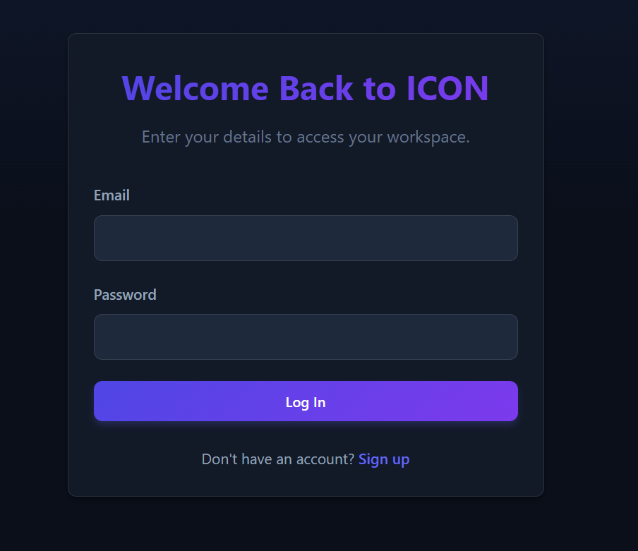
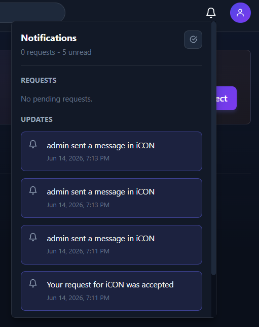

# ICON - Idea-CONnect: Project Collaboration Platform

## Project Report

**Course:** Web Technologies and Application  
**Project Title:** ICON - Idea-CONnect  
**Project Type:** Full-Stack Web Application  
**Technology Stack:** React, Node.js, Express, MongoDB, Socket.IO

---

## Abstract

ICON, short for Idea-CONnect, is a full-stack web application designed to help users create, discover, and collaborate on project ideas. The platform allows users to register, create project spaces, find public projects, send join requests, manage members, and work inside a shared project workspace.

The workspace includes shared notes, file uploads, and persistent real-time chat. Authentication is handled using JSON Web Tokens, while role-based access control is used to protect project-specific actions. Socket.IO is used for real-time chat communication, and MongoDB is used to store users, projects, workspaces, messages, requests, and notifications.

The project demonstrates practical implementation of key web technologies such as REST APIs, protected routing, database modeling, real-time communication, file handling, and frontend state management. ICON is currently implemented as a local working MVP.

---

## 1. Introduction

Modern student and developer teams often need to collaborate on ideas before they become complete products. In many cases, users rely on separate tools for project discovery, communication, file sharing, and team coordination. This creates fragmentation and makes collaboration less efficient.

ICON addresses this problem by combining project discovery and project-based collaboration into a single web application. A user can create a project, make it public or private, invite members, accept join requests, and collaborate inside a dedicated workspace.

The project was built as a MERN-style application using React for the frontend, Express and Node.js for the backend, and MongoDB for data storage. Socket.IO was added for real-time chat functionality.

---

## 2. Objectives

The main objectives of ICON are:

- To build a full-stack project collaboration platform.
- To provide secure user authentication.
- To allow users to create and manage projects.
- To support public project discovery.
- To implement a join request and invite workflow.
- To provide role-based access control for project operations.
- To create a shared workspace for each project.
- To support notes, file uploads, and project chat.
- To store chat messages persistently in MongoDB.
- To implement a notification system for requests and project updates.
- To design a responsive and usable frontend interface.

---

## 3. Problem Statement

Students and developers often have project ideas but lack a simple platform to find collaborators and manage early-stage project work. Existing tools are either too broad, too communication-focused, or not centered around idea discovery and team formation.

The problem can be summarized as:

> To design and implement a web-based platform where users can create project ideas, discover public projects, request to join teams, and collaborate inside a secure shared workspace.

---

## 4. System Architecture

ICON follows a client-server architecture.

The frontend is a React single-page application. It handles routing, user interface, form interactions, authentication state, and communication with the backend.

The backend is an Express server. It exposes REST API endpoints for authentication, users, projects, requests, notifications, messages, uploads, and workspace operations. It also runs a Socket.IO server for real-time project chat.

MongoDB is used as the database. Mongoose models define the structure of application data.

### Architecture Overview

```text
React Frontend
    |
    | REST APIs using Axios
    | Socket.IO Client
    v
Node.js + Express Backend
    |
    | Mongoose
    v
MongoDB Database
```

---

## 5. Technology Stack

### Frontend Technologies

- **React:** Used to build reusable UI components.
- **Vite:** Used as the frontend build tool and development server.
- **React Router DOM:** Used for client-side routing.
- **Axios:** Used for HTTP requests to the backend.
- **Socket.IO Client:** Used for real-time chat.
- **React Icons:** Used for icons in buttons and navigation.
- **CSS Modules:** Used for page/component-specific styling.

### Backend Technologies

- **Node.js:** JavaScript runtime for backend development.
- **Express.js:** Web framework used to build REST APIs.
- **MongoDB:** NoSQL database used for persistent storage.
- **Mongoose:** ODM used to define schemas and interact with MongoDB.
- **Socket.IO:** Used for real-time communication.
- **JWT:** Used for stateless authentication.
- **bcryptjs:** Used for password hashing.
- **Multer:** Used for file uploads.
- **dotenv:** Used for environment variable configuration.
- **cors:** Used to allow frontend-backend communication during development.

---

## 6. Database Design

The application uses the following main models:

### User

Stores user account and profile details.

Important fields:

- username
- name
- email
- password
- bio
- motto
- domain
- skills
- interests
- profilePicture

### Project

Stores project information and membership details.

Important fields:

- name
- description
- motto
- domain
- tags
- isPublic
- creator
- members
- workspace

Each member contains:

- user
- role

Supported roles:

- Admin
- Lead
- Editor
- Member
- Viewer

### Workspace

Stores notes and resources for a project.

Important fields:

- project
- notes
- resources

### Request

Stores join requests and project invitations.

Important fields:

- sender
- receiverUser
- receiverProject
- type
- status
- message

Request types:

- Join
- Invite
- Collab

Request statuses:

- Pending
- Accepted
- Rejected

### Message

Stores persistent project chat messages.

Important fields:

- chatId
- chatModel
- sender
- content
- timestamps

### Notification

Stores request, message, and update notifications.

Important fields:

- user
- content
- type
- relatedId
- isRead

---

## 7. Implementation Details

### 7.1 Authentication

The application supports user registration and login. Passwords are hashed using bcryptjs before being stored in MongoDB. After successful login or registration, the backend generates a JWT token.

The frontend stores the token in `localStorage` along with user information. Protected frontend routes use the authentication context to decide whether the user can access a page.

Backend protected routes use middleware to verify the JWT token from the `Authorization` header.

Important files:

- `backend/controllers/authController.js`
- `backend/middleware/auth.js`
- `frontend/src/context/AuthContext.jsx`

### 7.2 Project Management

Users can create projects by entering project name, description, motto, domain, tags, and visibility. When a project is created, the creator is automatically added as an Admin member.

For every project, a workspace is also automatically created.

Important files:

- `backend/models/Project.js`
- `backend/controllers/projectController.js`
- `frontend/src/pages/CreateProject.jsx`
- `frontend/src/pages/ProjectPage.jsx`

### 7.3 Dashboard and Discovery

The dashboard separates projects into two sections:

- **Your Projects:** Projects created by the user or projects where the user is a member.
- **Discover Projects:** Public projects created by other users.

The Discovery page allows users to search for public projects and registered users.

Important files:

- `frontend/src/pages/Dashboard.jsx`
- `frontend/src/pages/Discovery.jsx`

### 7.4 Role-Based Access Control

Role-Based Access Control is implemented on the backend. Sensitive project operations are protected based on project membership and role.

Examples:

- Only members can access a project workspace.
- Only Admin or Lead users can invite members.
- Workspace note and resource actions require project membership.

Important file:

- `backend/middleware/rbac.js`

### 7.5 Join Request and Invite Workflow

Users can request to join public projects. The request is sent to the project creator/admin. The admin can accept or reject the request through the notification panel.

When a request is accepted, the requesting user is added to the project members list.

Important files:

- `backend/models/Request.js`
- `backend/controllers/requestController.js`
- `backend/routes/requestRoutes.js`
- `frontend/src/components/NotificationsPanel.jsx`

### 7.6 Notifications

The notification system stores updates in MongoDB. It supports:

- join request notifications
- invite notifications
- accept/reject update notifications
- chat message notifications
- read/unread state
- mark all as read

The frontend notification panel displays pending requests and update notifications.

Important files:

- `backend/models/Notification.js`
- `backend/routes/notificationRoutes.js`
- `frontend/src/components/NotificationsPanel.jsx`

### 7.7 Workspace

Each project has a workspace with three main sections:

1. **Notes**
2. **Files**
3. **Chat**

Notes are saved inside the workspace document. Files are uploaded to the backend and stored locally in the `uploads` directory. Resource metadata is saved in the workspace.

Important files:

- `backend/models/Workspace.js`
- `backend/controllers/workspaceController.js`
- `frontend/src/pages/Workspace.jsx`

### 7.8 Persistent Real-Time Chat

Project chat uses Socket.IO for real-time message delivery. The socket connection is authenticated using the user's JWT token.

When a user enters a project workspace:

1. The frontend loads chat history using a REST API.
2. The frontend connects to Socket.IO using the JWT token.
3. The backend verifies the token.
4. The user joins a room based on the project ID.
5. When a message is sent, the backend checks project membership.
6. The message is saved in MongoDB.
7. The saved message is broadcast to all users in the project room.
8. Notifications are created for other project members.

Important files:

- `backend/server.js`
- `backend/models/Message.js`
- `backend/routes/messageRoutes.js`
- `frontend/src/pages/Workspace.jsx`

### 7.9 File Upload

File upload is implemented using Multer. Files are stored locally inside the backend uploads directory and served through Express static middleware.

Important file:

- `backend/routes/uploadRoutes.js`

---

## 8. User Interface

The frontend uses a dark-themed interface with cards, buttons, tabs, dropdowns, and responsive layouts. The main pages are:

- Login
- Signup
- Dashboard
- Discovery
- Profile
- Create Project
- Project Page
- Workspace

The workspace uses tab navigation for Notes, Files, and Chat. The chat interface distinguishes the current user's messages from other members' messages and auto-scrolls to the newest message.

---

## 9. Testing and Verification

The following checks were performed during development:

- Frontend linting using ESLint.
- Frontend production build using Vite.
- Backend JavaScript syntax checks using Node.
- Manual testing of login and signup.
- Manual testing of project creation.
- Manual testing of join request flow.
- Manual testing of admin accept/reject flow.
- Manual testing of workspace notes.
- Manual testing of file upload handling.
- Manual testing of persistent chat after page refresh.
- Manual browser verification of project and workspace pages.

The project is currently tested as a local development application.

---

## 10. Results

The implemented system successfully provides:

- secure authentication
- project creation and discovery
- project membership management
- role-based access control
- request and invite workflow
- workspace notes
- local file uploads
- persistent real-time chat
- notification panel with unread state

The application works as a local MVP and demonstrates multiple important concepts in modern web application development.

## Screenshots

### Login Page



### Dashboard


### Project Page


### Workspace Notes


### Workspace Chat


### Notifications



---

## 11. Limitations

The current implementation has the following limitations:

- The project is not deployed and currently runs locally.
- Uploaded files are stored locally, which is not ideal for production deployment.
- There are no automated unit or integration tests.
- Notes are shared but not real-time collaborative documents.
- Notifications are implemented for requests, chat, and request updates, but not for every workspace action.
- There is no task board or issue tracking module yet.
- There is no password reset feature.

---

## 12. Future Scope

Possible improvements include:

- Deploying the project using Render and MongoDB Atlas.
- Moving file uploads to Cloudinary or AWS S3.
- Adding a task board for project management.
- Adding project activity logs.
- Adding read receipts for chat messages.
- Adding notification filters.
- Adding automated backend API tests.
- Adding email verification and password reset.
- Adding an AI assistant for summarizing workspace notes and chat.

---

## 13. Conclusion

ICON - Idea-CONnect is a full-stack collaboration platform that combines project discovery, team formation, workspace collaboration, persistent chat, file upload, and notifications. The project successfully demonstrates authentication, role-based access control, REST API design, MongoDB schema modeling, real-time communication using Socket.IO, and frontend development using React.

Although the application is currently a local MVP and not a deployed production system, it provides a strong foundation for a real collaboration platform and can be extended further with deployment, cloud storage, task management, and automated testing.

---

## References

1. React Documentation - https://react.dev/
2. Node.js Documentation - https://nodejs.org/
3. Express.js Documentation - https://expressjs.com/
4. MongoDB Documentation - https://www.mongodb.com/docs/
5. Mongoose Documentation - https://mongoosejs.com/
6. Socket.IO Documentation - https://socket.io/docs/
7. JSON Web Token Introduction - https://jwt.io/introduction
8. Multer Documentation - https://github.com/expressjs/multer
